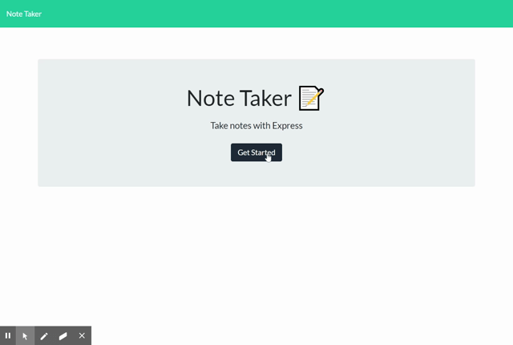

# Express-note-taker

MSU Coding Boot Camp Homework 11

## Table of Contents

* [Description](#Description)
* [User Story](#User-Story)
* [Acceptance Criteria](#Acceptance-Criteria)
* [Deployed App](#Deployed-App)
* [App Demo](#App-Demo)

## Description

This application that can be used to write, save, and delete notes. This application will use an express backend and save and retrieve note data from a JSON file.

## User Story

AS A user, I want to be able to write and save notes

I WANT to be able to delete notes I've written before

SO THAT I can organize my thoughts and keep track of tasks I need to complete

## Acceptance Criteria

Application should allow users to create and save notes.

Application should allow users to view previously saved notes.

Application should allow users to delete previously saved notes.

## Deployed App

Link to the deployed app through Heroku: [Heroku link](https://hw11-express-note-taker.herokuapp.com/)

## App Demo

